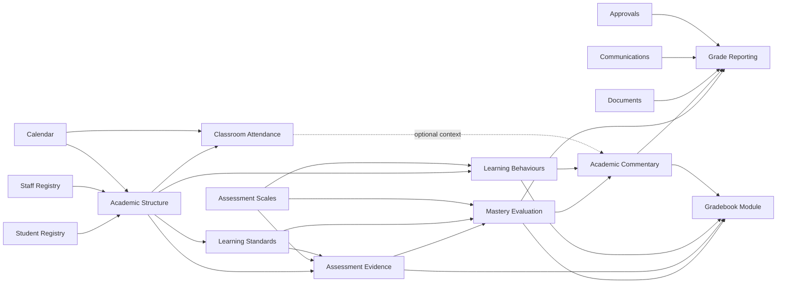

# Gradebook decomposition

## Purpose

This specification decomposes the existing standards-based gradebook workbook into independently operational components and the internal parts they own. The target is a Gradebook module assembled through explicit contracts rather than a single feature that duplicates people, calendar, document, or communication records.

The source workbook combines setup, roster, weekly evidence entry, classroom attendance, learning behaviours, standards aggregation, comment generation, and report output. Those workflows are useful, but their concerns must be separated before implementation.

## Boundaries

- A **part** is an internal building block. It has no independent catalogue toggle, heartbeat, health contract, or insight feed.
- A **component** is the smallest independently operational capability. It owns records and contracts, and supplies health, usage, data-quality, and operational insights.
- A **module** composes components without taking ownership of their source records.
- Event Attendance is for meetings, activities, trips, and events. Classroom Attendance is a separate academic component.

## Components

| Component | Purpose | Principal owned parts | Required dependencies |
|---|---|---|---|
| Academic Structure | Establishes the teaching context in which evidence exists. | academic year; term/reporting period; subject/course; class/section; teaching assignment; student enrolment/roster | Calendar, Student Registry, Staff Registry |
| Learning Standards | Maintains the assessable learning model. | framework; standard; code; description; hierarchy; subject/grade applicability; version and lifecycle | Academic Structure |
| Assessment Scales | Defines how evidence and proficiency are expressed. | scale; ordered level; descriptor; value; proficiency threshold; incomplete/missing state | None |
| Assessment Evidence | Captures a student's assessable work without deciding mastery. | assessment; assessment category; standard mapping; student result; attempt; date; assessor; evidence status; note | Academic Structure, Learning Standards, Assessment Scales |
| Mastery Evaluation | Applies an explicit policy to evidence and produces explainable academic outcomes. | aggregation policy; evidence selection; weighting rule; standard result; course result; strength/weakness; confidence/completeness | Assessment Evidence, Learning Standards, Assessment Scales |
| Learning Behaviours | Records and evaluates non-grade learning behaviours. | behaviour framework; domain; observation/rating; scale mapping; period aggregate | Academic Structure, Assessment Scales |
| Classroom Attendance | Records presence in scheduled teaching contexts. | attendance session; attendance code; student mark; correction/reason; period aggregate | Academic Structure, Calendar, Student Registry; later Timetable |
| Academic Commentary | Produces evidence-backed drafts while preserving teacher authorship. | template library; fragment rule; strength/weakness/goal selection; preferred-name/pronoun rendering; draft; teacher edit; length/completeness check | Mastery Evaluation, Learning Behaviours; optional Classroom Attendance and Student Profile |
| Grade Reporting | Freezes, approves, publishes, and exports reporting-period outcomes. | report snapshot; reporting-period result; sign-off; moderation/approval; publication state; published version; export | Mastery Evaluation, Academic Commentary, Documents, Communications, Approvals |

## Relationship model

## Gradebook module

The core Gradebook module composes:

1. Academic Structure
2. Learning Standards
3. Assessment Scales
4. Assessment Evidence
5. Mastery Evaluation
6. Learning Behaviours
7. Academic Commentary

Classroom Attendance remains independently operational. Gradebook may consume its aggregates as optional commentary and insight context, but attendance must never change an academic grade by default. Grade Reporting is the publication boundary and can be enabled with Gradebook or reused by a wider reporting module.

## Foundational contracts

### Universal provisioning

- Every teaching group produces a gradebook instance, including academic classes, homerooms, advisory groups, clubs, and support groups.
- Provisioning is idempotent and keyed by academic year, provider-neutral teaching-group key, and optional subject. Scheduled lessons do not create separate gradebooks.
- A universally provisioned gradebook may be graded, standards-only, narrative-only, evidence-only, or dormant; existence never forces an artificial grade.
- The future Scheduler is an authoritative teaching-group provider, not a database dependency. Until it exists, the same contract accepts controlled manual/test provisioning.
- All assigned teachers have equal operational access. Authorship and every change remain individually attributable.
- A transferred student's evidence remains with the originating gradebook and is exposed to the receiving context only as authorised history.

### Governance and reporting periods

- Superusers and principals govern grading models, scales, policies, reporting periods, and permitted override behaviour. Teachers apply those policies and make only authorised, reasoned, audited overrides.
- Reporting-period configuration resolves in this order: gradebook override, course/subject, programme, school default.
- Alternative periods support partial-credit electives, short courses, and subject-specific patterns without changing the school's academic-year boundary.
- Effective configurations are versioned and attached to results and published snapshots.

### Identity and ownership

- Registry components remain authoritative for people; Gradebook stores stable references, never duplicate profiles.
- Academic Structure owns enrolment in a class and the teacher/class relationship.
- Every result resolves to one student, class/course, academic year, reporting period, and assessment or standard.
- Components exchange identifiers and versioned events through contracts; they do not read another component's private tables.

### Evidence and standards

- One assessment may address multiple standards and one standard may receive evidence from multiple assessments.
- An attempt is immutable evidence. A correction supersedes it with an auditable reason rather than overwriting history.
- Missing, incomplete, invalid, and not-yet-assessed are distinct states. None is silently discarded or automatically converted to zero.
- Formative, summative, homework, and other categories are configurable classifications, not hard-coded columns.
- Standard frameworks, scales, and mastery policies are versioned so historical reports remain reproducible after configuration changes.

### Evaluation

- Mastery calculation is policy-driven, deterministic, explainable, and testable.
- A result records the policy version and source evidence used to produce it.
- Confidence and completeness accompany calculated outcomes so sparse evidence is visible.
- Academic achievement and learning behaviours remain separate result domains.

### Commentary and publication

- Generated commentary is an advisory draft backed by identifiable results; the teacher controls the final wording.
- Preferred name and pronouns come from the student profile or neutral-language defaults, never a binary gender selector embedded in Gradebook.
- Published reports are immutable snapshots. Later corrections produce a new version with an audit trail.
- Publication requires permission and configured sign-off/moderation; draft visibility does not imply publication.

### Access

- Teachers can enter and review evidence only for assigned classes unless delegated.
- Academic leaders can review, moderate, and report within their authorised scope.
- Principals and superusers can view component/module health and authorised operational insights.
- Configuration and policy changes require elevated roles and auditing.
- Future student/parent access is read-only and limited to explicitly published records.

### Intelligence

- Each component and the composed module emits its own heartbeat, health, usage, and data-quality signals.
- Operational components additionally emit contextual insights such as missing evidence, declining mastery, attendance concerns, or reports awaiting sign-off.
- Parts emit neither independent health signals nor insights.
- Cross-component correlation belongs to the Insights engine and must retain links to the underlying evidence.

## Workbook-to-platform mapping

| Workbook concern | Platform destination |
|---|---|
| Teacher, class, subject, room, block and roster setup | Academic Structure, referencing Staff/Student Registry and later Rooms/Timetable |
| Subject shorthand and standard labels | Learning Standards |
| Seven-point descriptors and thresholds | Assessment Scales |
| Weekly standard scores and formative assessment | Assessment Evidence |
| Standard averages, strongest/weakest standard, overall performance | Mastery Evaluation |
| Academic participation, homework, self-management, social skills, communication | Learning Behaviours |
| P/L/A daily entries and attendance aggregate | Classroom Attendance |
| Lookup fragments, goal selection, pronoun fragments and generated prose | Academic Commentary |
| Final comments, custom edits and length counts | Academic Commentary draft plus Grade Reporting snapshot |

## Build order

1. Academic Structure: first establish canonical academic context and roster contracts.
2. Learning Standards and Assessment Scales: build the two reusable configuration components.
3. Assessment Evidence: implement auditable evidence entry, status handling, and standard mappings.
4. Mastery Evaluation: implement versioned policies and explainable results.
5. Learning Behaviours: separate non-grade observations from academic results.
6. Classroom Attendance: implement independently, then expose optional aggregate contracts.
7. Academic Commentary: generate evidence-backed, editable drafts.
8. Grade Reporting: add snapshots, workflow, publication, and export.
9. Gradebook Module: certify the composed dependency graph, module health, insights, permissions, and end-to-end workflows.

This order creates independently useful components at each stage while preventing the workbook's presentation layout from becoming the platform's data model.

## Implementation status

The foundational Gradebook module is operational. Its certified composition is:

1. Academic Structure and universal Gradebook provisioning.
2. Assessment Scales, Learning Standards, Assessment Evidence, Evaluation Policies, and Grade Evaluation.
3. Gradebook Workspace with strict reporting-period resolution and 50-row roster pagination.
4. Learning Behaviours and Classroom Attendance as independent, non-grade domains.
5. Academic Commentary as evidence-backed, teacher-editable drafts.
6. Grade Reporting as hashed immutable snapshots with submission, moderation, publication, and version lineage.
7. Gradebook composite readiness, operational insights, health reporting, Builder dependencies, and the Principal'ed workspace UI.

The Scheduler remains a future authoritative teaching-group provider. The Gradebook contract is provider-neutral, so scheduling integration will provision and update teaching groups without changing Gradebook ownership or schema.
